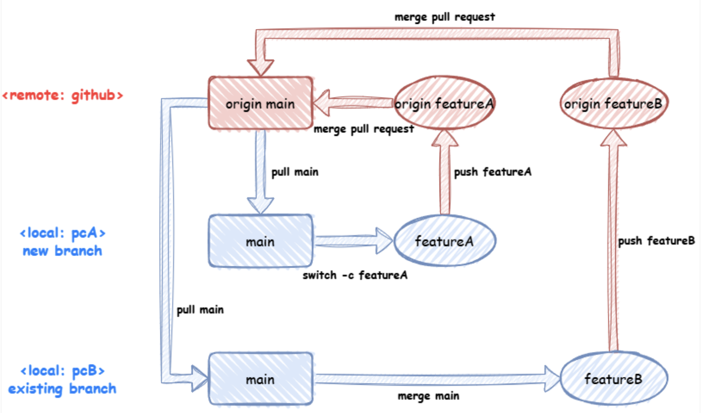
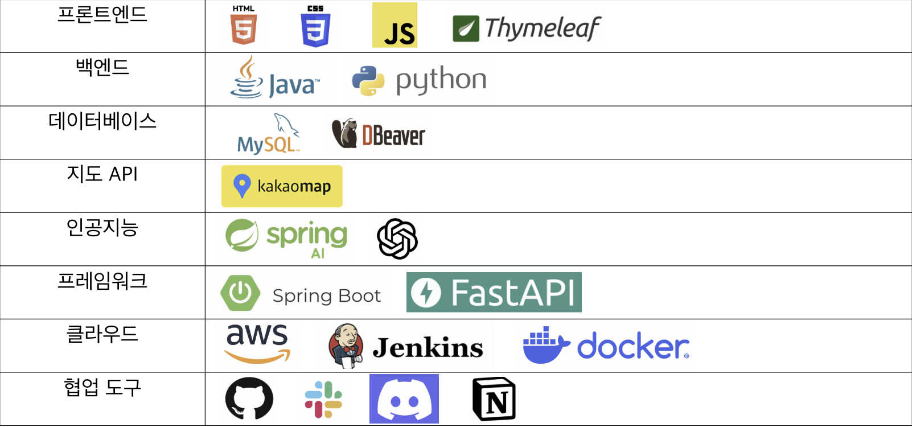

# 🧩 MatchingBot - AI 기반 HR 매칭 플랫폼

AI 기반 이력서-채용공고 매칭 서비스를 개발한 팀 프로젝트입니다.  
본 프로젝트에서 **백엔드 주요 기능 개발 및 API 설계**를 담당했습니다.

---
## ERD

## Git

## Language

## 📌 주요 기능 (내 담당 파트 중심 정리)

- **채용공고 검색 필터링 기능 개발**
    - 직군 → 직종 → 직무 선택 구조 구현 (다단계 직무 선택 UI)
    - 지역, 경력 유형(New/Exp) 필터링 API 설계
    - 동적 JPQL 기반 검색 쿼리 작성 (Spring Data JPA 활용)

- **지도 기반 채용공고 표시 기능**
    - Kakao Map API 연동
    - 내 위치 기반 반경 내 채용공고 마커 표시
    - 주소 검색 기반 마커 표시 및 상세 페이지 이동 처리

- **커뮤니티 게시판 CRUD 기능**
    - 게시글 작성/수정/삭제, 댓글 작성 기능
    - 회원 유형에 따른 권한 제어 (로그인 여부에 따른 권한 처리)

- **기업회원 이력서 검색 및 즐겨찾기 기능**
    - 기업회원 이력서 검색 API 설계
    - 이력서 즐겨찾기 및 상세 보기 기능

- **챗봇 메뉴 이동 기능**
    - Spring Security 기반 사용자 권한별 챗봇 응답 처리
    - GPT API 연동 (기본 질의응답 및 페이지 이동 지원)

---

️- **코드 스니펫 추가**  
java
@GetMapping("/api/jobs/search")
public ResponseEntity<List<SearchPostingDto>> searchJobs(
@RequestParam String jobRoleName,
@RequestParam String region,
@RequestParam String careerType) {
return ResponseEntity.ok(searchPostingService.searchJobs(jobRoleName, region, careerType));
}
## 🛠 기술 스택

- **Backend**: Java 17, Spring Boot, JPA (Hibernate), MySQL
- **Frontend**: Thymeleaf, HTML/CSS, JavaScript
- **API 연동**: Kakao Map API, OpenAI API (LLM 활용)
- **Infra**: AWS EC2, S3
- **협업 도구**: GitHub, Notion, Figma, IntelliJ, Git

---

## 🧑‍💻 주요 학습 및 경험

- 실전 협업 환경에서의 Git 브랜치 전략, PR 병합 충돌 해결
- API 설계, DB 스키마 설계, ERD 작성 및 테이블 설계
- Spring Security를 통한 권한 제어 및 사용자 인증
- 외부 API 통합 및 실시간 지도 서비스 구현
- LLM 기반 AI 기능 적용 경험

---

## 📂 프로젝트 구조

matching-bot/
├── backend/
├── frontend/
├── database/
└── README.md